# WeChat Cover Design

一个宿主无关的公众号封面设计 Skill：从文章、标题、提纲或 brief 中提炼视觉核心，从 13 套科学、杂志、产业、临床与生物工艺主题中匹配风格，使用固定版式和可选开源字体输出稳定封面。

## 主题画廊

所有主题均使用同一封面文案样例展示：`in vivo CAR-T / 抗体偶联 LNP / 技术路径深度研究`。正式使用时，标题内容替换为用户提供的准确标题。

| 主题 1 | 主题 2 | 主题 3 |
| --- | --- | --- |
| [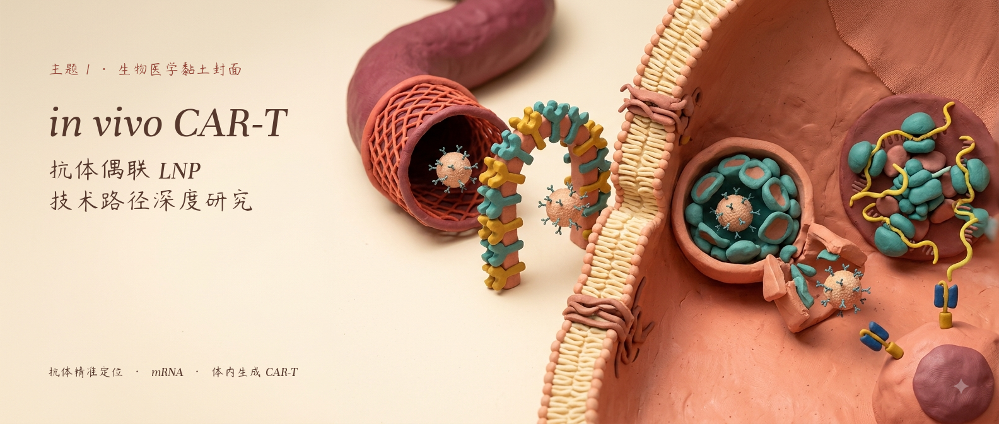](assets/theme-previews/titled/theme1-clay-diorama.png) | [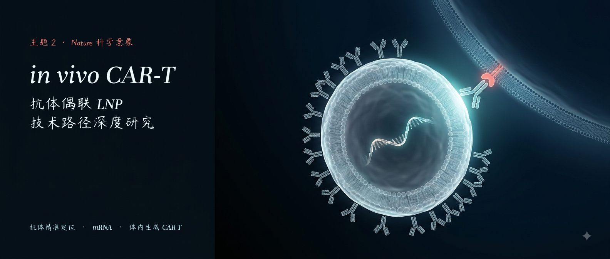](assets/theme-previews/titled/theme2-nature-science.png) | [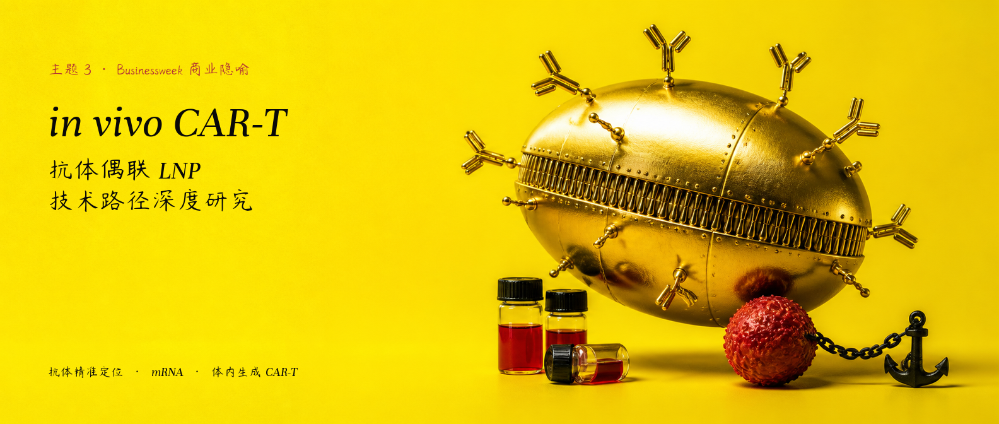](assets/theme-previews/titled/theme3-businessweek.png) |
| 粘土微缩剖面 | Nature 科学意象 | Businessweek 商业隐喻 |

| 主题 4 | 主题 5 | 主题 6 |
| --- | --- | --- |
| [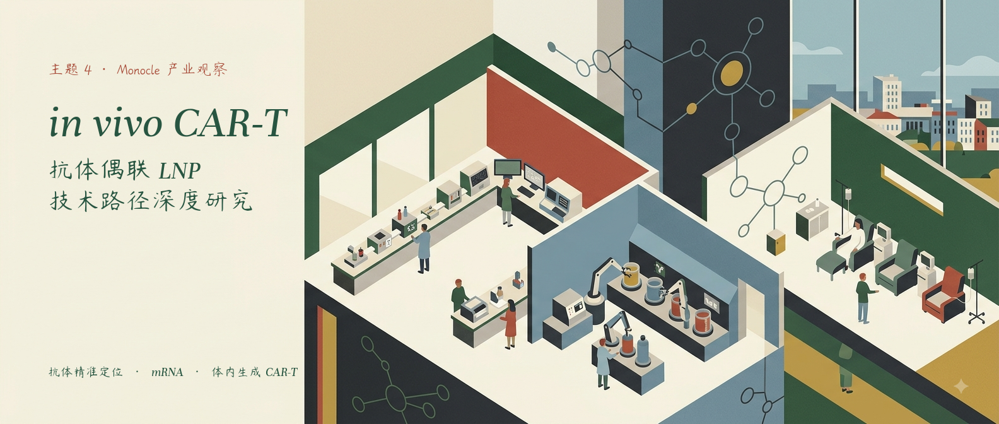](assets/theme-previews/titled/theme4-monocle.png) | [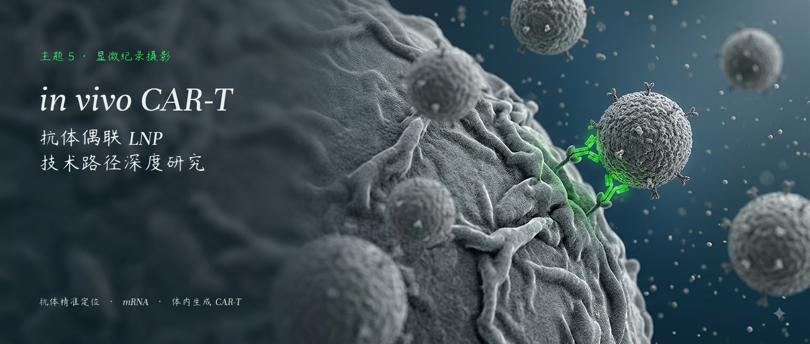](assets/theme-previews/titled/theme5-micro-documentary.png) | [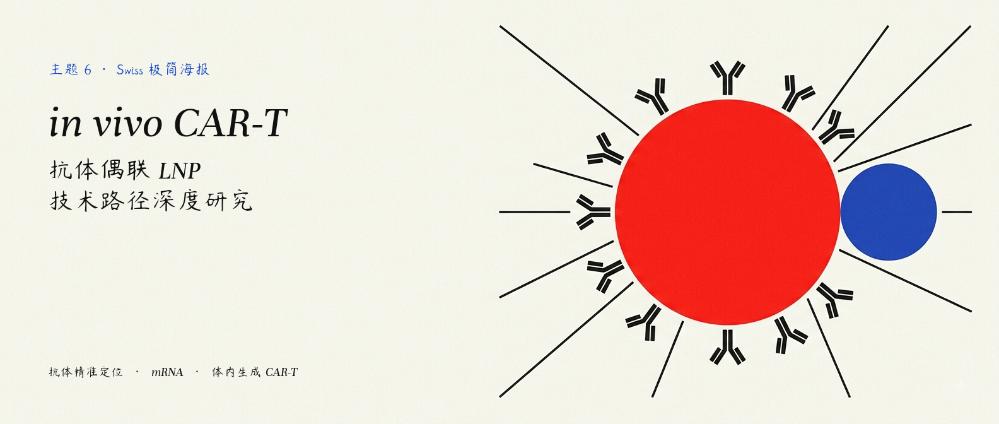](assets/theme-previews/titled/theme6-swiss-poster.png) |
| Monocle 产业观察 | 显微纪录摄影 | Swiss 极简海报 |

| 主题 7 | 主题 8 | 主题 9 |
| --- | --- | --- |
| [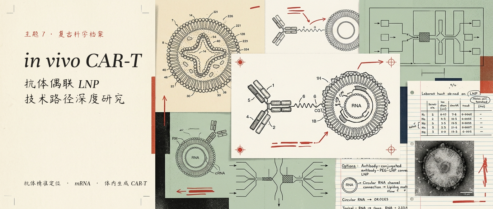](assets/theme-previews/titled/theme7-science-archive.png) | [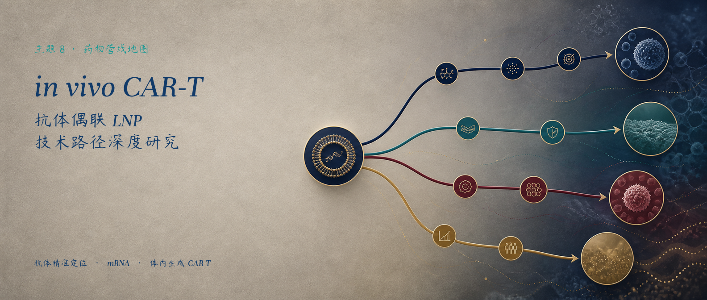](assets/theme-previews/titled/theme8-pipeline-map.png) | [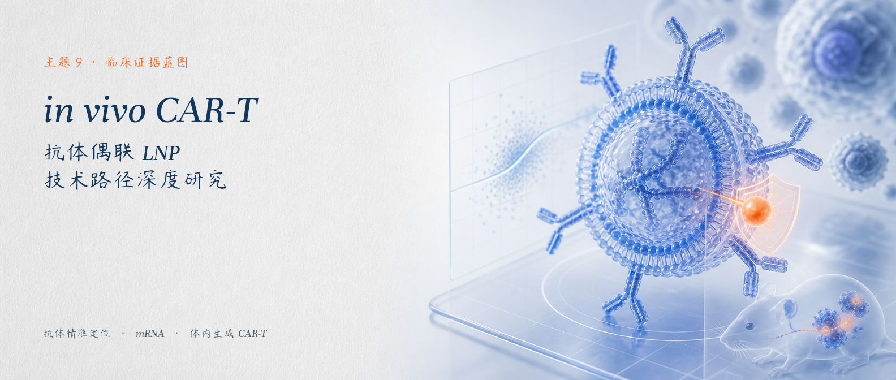](assets/theme-previews/titled/theme9-clinical-evidence.png) |
| 复古科学档案 | 药物管线地图 | 临床证据蓝皮书 |

| 主题 10 | 主题 11 | 主题 12 |
| --- | --- | --- |
| [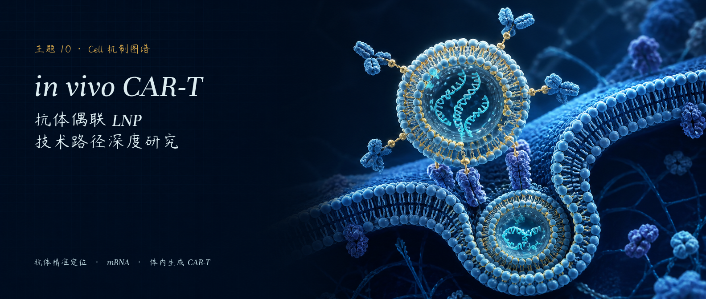](assets/theme-previews/titled/theme10-cell-mechanism.png) | [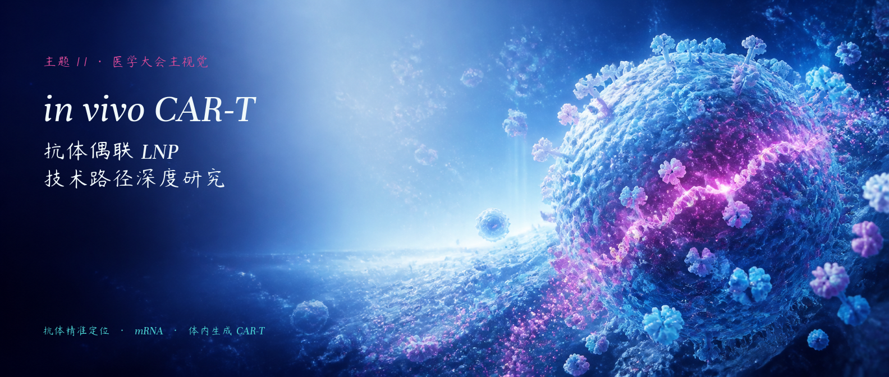](assets/theme-previews/titled/theme11-medical-congress.png) | [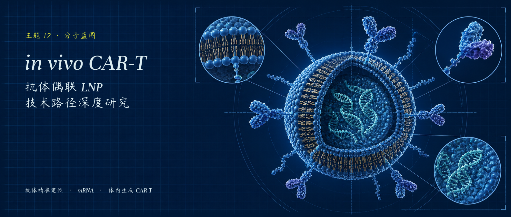](assets/theme-previews/titled/theme12-molecular-blueprint.png) |
| Cell 机制图谱 | 医学大会主视觉 | 分子蓝图 |

| 主题 13 |
| --- |
| [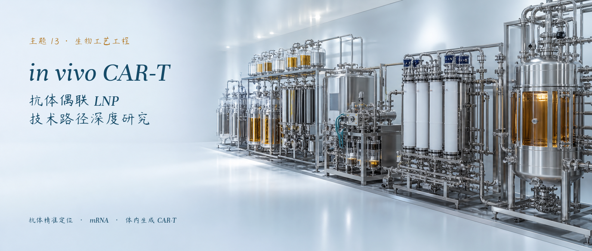](assets/theme-previews/titled/theme13-bioprocess.png) |
| 生物工艺工程 |

## 字体

字体资产位于 `assets/fonts/`。中文默认字体为 `YangRendongZhushi-Light.ttf`，也可通过字体 key 选择 `pixel`、`baituxiaobai`、`hanchan_zhengkai`、`qingliu_lishu`、`xieling` 或 `yunfeng_hanchan`；13 张封面中的英文锁定使用 `PreTesto_it.ttf`。

## 固定版式

所有封面统一为 `1584x672`。标题区默认固定为 `x=76..620, y=88..585`，主标题一行，副标题两行，底部保留一行主题说明。标题直接放置在背景图自然留白中，不添加卡片、下划线、分隔线或阴影。详见 `references/typography_layout.md`。

## 运行

```text
python scripts/compose_cover.py --input <background.png> --output <cover.png> --theme 1
```

主题选择、英文 prompt 和中文创作说明仍由 `SKILL.md` 规定；本仓库只负责封面设计，不负责撰写文章标题和摘要。
