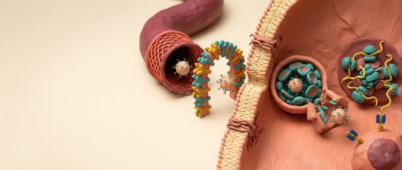
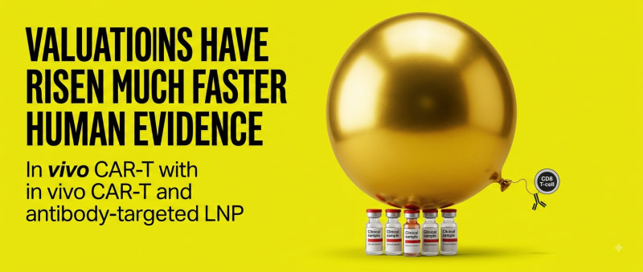
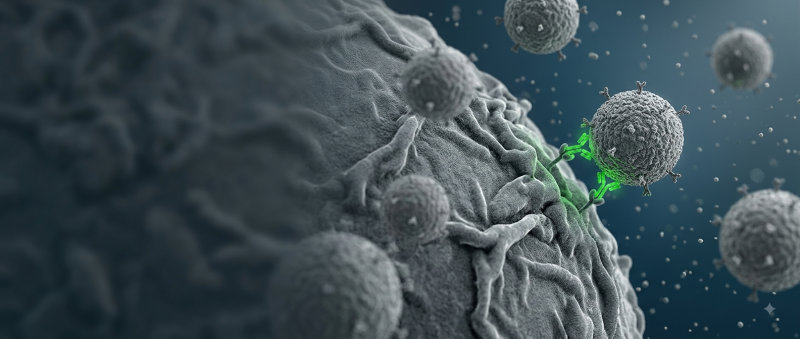
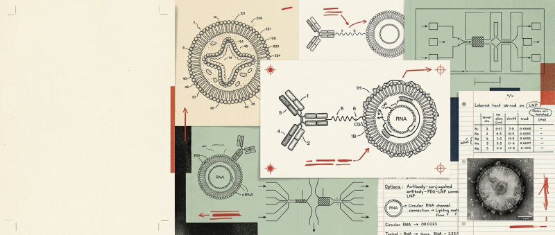
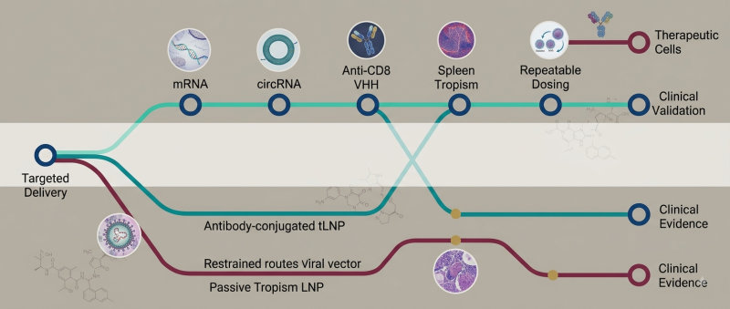
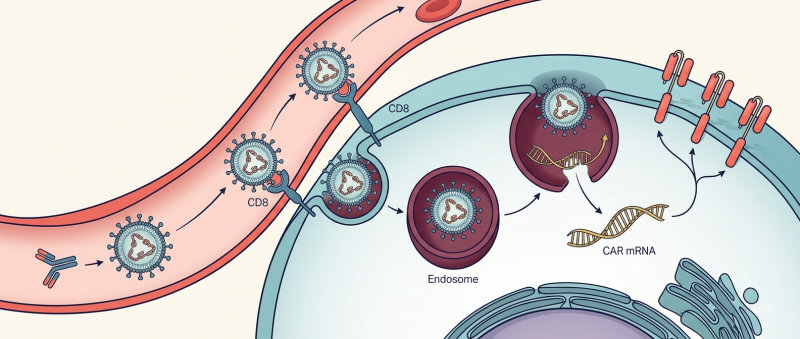
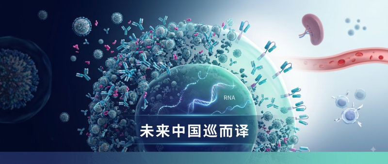
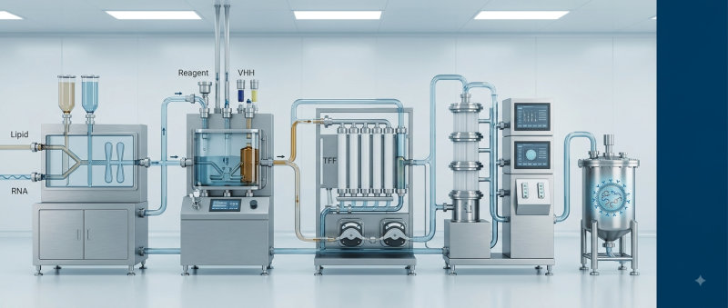

# WeChat Cover Design

一个宿主无关的公众号封面设计 Skill：从文章、标题、提纲或内容 brief 中提炼视觉核心，从 16 套视觉主题中选择合适风格，输出可直接交给文生图工具的英文 prompt 和中文创作说明。

## 核心原则

- **Prompt-first**：任何能加载 `SKILL.md` 的 Agent 都能完成核心工作。
- **工具协商**：有宿主原生生图能力就用原生能力；没有就交付 prompt，不因缺少 API Key 失败。
- **后期优先处理精确小字**：生成模型适合标题级文字，不适合长中文注释、图表标签和小字号正文。
- **水印诚实标注**：negative prompt 只能约束视觉内容，通常不能去掉平台强制水印。
- **尺寸按比例处理**：目标约为 2.35:1，裁剪判断根据实际宽高，不绑定某个模型的固定尺寸。

## 主题库

- 主题一：学术机制图风——机制解析、概念逻辑链、信息密度高。
- 主题二：手绘信息图风——从旧到新、痛点到解决方案、技术对比。
- 主题三：顶刊科研封面风——重大发现、深度解读、单一强视觉隐喻。

以下 13 款为已确认并附参考图的主题模板，均为本 Skill 生成的公众号封面实例。参考图用于约束媒介、构图、色板和视觉层级；正式出图默认生成无字底图，再后期叠加准确标题。点击缩略图可查看完整预览。

### 封面模板实例一览

<table>
  <tr>
    <td align="center"><a href="assets/theme-previews/theme4-clay-diorama.png"></a><br><b>主题四</b> · 粘土微缩剖面</td>
    <td align="center"><a href="assets/theme-previews/theme5-nature-science.png"></a><br><b>主题五</b> · Nature 科学意象</td>
    <td align="center"><a href="assets/theme-previews/theme6-businessweek.png"></a><br><b>主题六</b> · 商业隐喻</td>
  </tr>
  <tr>
    <td align="center"><a href="assets/theme-previews/theme7-monocle.png"></a><br><b>主题七</b> · 产业观察</td>
    <td align="center"><a href="assets/theme-previews/theme8-micro-documentary.png"></a><br><b>主题八</b> · 显微纪录</td>
    <td align="center"><a href="assets/theme-previews/theme9-swiss-poster.png"></a><br><b>主题九</b> · 极简海报</td>
  </tr>
  <tr>
    <td align="center"><a href="assets/theme-previews/theme10-science-archive.png"></a><br><b>主题十</b> · 科学档案</td>
    <td align="center"><a href="assets/theme-previews/theme11-pipeline-map.png"></a><br><b>主题十一</b> · 管线地图</td>
    <td align="center"><a href="assets/theme-previews/theme12-clinical-evidence.png"></a><br><b>主题十二</b> · 临床证据</td>
  </tr>
  <tr>
    <td align="center"><a href="assets/theme-previews/theme13-cell-mechanism.png"></a><br><b>主题十三</b> · 机制图谱</td>
    <td align="center"><a href="assets/theme-previews/theme14-medical-congress.png"></a><br><b>主题十四</b> · 大会主视觉</td>
    <td align="center"><a href="assets/theme-previews/theme15-molecular-blueprint.png"></a><br><b>主题十五</b> · 分子蓝图</td>
  </tr>
  <tr>
    <td align="center" colspan="3"><a href="assets/theme-previews/theme16-bioprocess.png"></a><br><b>主题十六</b> · 生物工艺</td>
  </tr>
</table>

**应用场景速查**

- **主题四 · 生物医学粘土微缩剖面风** —— 细胞递送、受体结合、内吞、内涵体逃逸、RNA 翻译、药物作用机制，以及需要亲和表达的 3–7 步生物学过程。
- **主题五 · Nature 科学意象风** —— 重大科研突破、前沿机制、单一核心发现、技术平台发布；强调一个宏大科学主体和一个关键交互。
- **主题六 · Bloomberg Businessweek 商业隐喻风** —— 估值与证据错配、BD 交易、资本泡沫、商业争议和尖锐行业判断；用三秒可懂的视觉比喻表达观点。
- **主题七 · Monocle 理性产业观察风** —— 产业链、研发—生产—临床生态、园区、CDMO、供应链和国际竞争格局；适合多模块全景观察。
- **主题八 · 显微纪录摄影风** —— 细胞表面结合、纳米递送、病原体与免疫、组织微环境和实验发现；强调真实尺度、景深和显微质感。
- **主题九 · Swiss International Style 极简理性海报** —— 技术二元关系、核心命题、方法论宣言和品牌化研究观点；将复杂内容压缩为 2–4 个几何对象。
- **主题十 · 复古科学档案风** —— 专利拆解、技术史、机制溯源、工程壁垒、老文献复盘和调查型深度研究。
- **主题十一 · 药物管线地图风** —— 企业管线、靶点布局、技术路线竞争、研发里程碑、国内外玩家和 BD 格局。
- **主题十二 · 临床证据蓝皮书风** —— 临床数据解读、疗效与安全性、剂量递增、队列比较、医学事务报告和生物医药投资研究。
- **主题十三 · Cell 机制图谱风** —— 细胞机制、递送链路、信号通路、药物作用机制和连续多步骤生物过程。
- **主题十四 · 医学大会主视觉风** —— 年度综述、重磅数据、医学会议总结、临床转化里程碑和前沿趋势发布。
- **主题十五 · 分子蓝图风** —— 分子设计、抗体结构、脂质配方、偶联化学、药物平台原理和结构专利拆解。
- **主题十六 · 生物工艺工程风** —— CMC、工艺开发、放大生产、偶联、TFF、纯化、灌装、质量控制和 CDMO。

## 使用方式

把文章或内容 brief 交给支持 Skill 的 Agent，并提出“设计公众号封面”或“生成封面 prompt”。Skill 会：

1. 抽取内容类型、读者钩子、核心对象链、关键数据和文字清单；
2. 读取主题注册表并选择一个主题；
3. 按选定主题填充 prompt；
4. 根据宿主能力选择原生出图、可选适配器或 prompt-only；
5. 在交付前检查占位符、画幅、主题骨架、文字策略和水印状态。

## 出图路径

优先级如下：

1. 宿主原生文生图工具；
2. 宿主提供的图像 API 或连接器；
3. 本仓库的可选 OpenAI-compatible 适配器；
4. 只交付英文 prompt。

本仓库不假设任何 Agent 名称、安装目录、命令行环境或输出目录。若使用适配器，路径和输出目录由宿主决定。

## 可选脚本

### Prompt 校验

推荐使用跨平台 Python 校验器：

```text
python scripts/validate_prompt.py --all < prompt.txt
```

没有 Python 时，可以使用 shell wrapper：

```text
bash scripts/validate-prompt.sh --all < prompt.txt
```

校验器检查残留占位符、画幅描述、Negative prompt、长度和文本策略提示。它是辅助工具，不是 Skill 的运行前提。

### OpenAI-compatible 适配器

`scripts/generate-cover.js` 只用于宿主明确支持 Node.js、网络请求和 OpenAI-compatible Images API 的情况。它需要 API Key 和 provider 配置；没有这些条件时，请走宿主原生工具或 prompt-only 路径。

适配器支持 `--size WIDTHxHEIGHT`。它会按照实际比例输出微信封面的裁剪或补边指引，不再只识别某一个固定尺寸。

## 目录结构

```text
wechat-cover-design/
├── SKILL.md
├── skill.json
├── README.md
├── assets/
│   └── theme-previews/
│       ├── theme4-clay-diorama.png
│       ├── theme5...theme16.png
│       └── thumbs/            # README 模板实例画廊所用的缩略图
├── references/
│   ├── theme_registry.md
│   ├── _theme_template.md
│   ├── cover_theme1_academic.md
│   ├── cover_theme2_handdrawn.md
│   ├── cover_theme3_journal.md
│   ├── cover_theme4_claydiorama.md
│   └── cover_themes5_16_selected.md
├── scripts/
│   ├── generate-cover.js
│   ├── validate_prompt.py
│   └── validate-prompt.sh
└── evals/
    ├── trigger_eval.json
    └── theme_match_eval.json
```

新增主题时，复制 `references/_theme_template.md`，补齐色板、布局、内容 schema、英文 prompt、Negative prompt、回退策略和主题区分表，再登记到 `references/theme_registry.md` 并加入真实 eval。

## 与标题摘要 Skill 的关系

本 Skill 只负责封面设计，不负责标题和摘要。用户同时需要标题、摘要和封面时，可由宿主协调标题摘要 Skill，再把最终标题和内容 brief 交给本 Skill。
